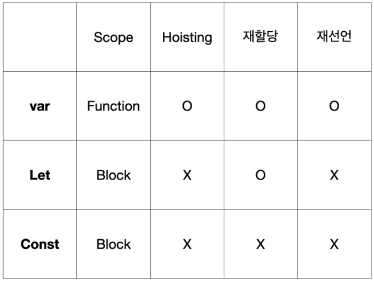

# 변수 선언 (var, let, const)

> ES6 이후에 추가된 변수들에 대해 알아본다.
>
> var, let, const

### var

- Function Scope(함수 스코프)로 동작한다.

  - 단점

    1. 전역변수가 남발하고, 이는 전역 스코프를 오염시킨다.
    2. 이미 만들어진 변수이름으로 재선언해도 아무런 문제가 발생하지 않는다.
    3. 호이스팅으로 인해 Reference Error가 발생하지 않아 원인을 찾기 힘들다.

  - 예시)

    ```javascript
    // 이미 만들어진 변수이름으로 재선언이 가능
    var a = 'helloWorld';
    var a = 'helloWorld2';
    
    // 호이스팅으로 인한 문제 발생
    var x = 1;
    function xPrint(){
      var x = 5;
      console.log(x); //5
    }
    xPrint(); //5
    console.log(x); //1
    ```


### let, const

- Block Scope로 동작한다.

  - var 와 차이점

    - block-scoped 단위로 hoisting(호이스팅)이 일어나고, 블록안에서 선언된 변수가 블록 밖에는 영향을 끼치지 않는다.
    - 동일한 블록안에서 재선언이 불가능

  - let과 const의 차이점

    - const : 재할당할 수 없다. (Error 발생) 그러므로 선언과 동시에 할당이 필요하다.
    - let : 재할당 가능하다.

  - 예시)

    ```javascript
    // let - 재선언 불가능, 재할당 가능
    let a = 'helloWorld';
    let a = 'helloWorld2'; //Uncaught SyntaxError : Identifier 'a' has already been declared
    a = 'helloWorld3'; //가능
    
    // const - 재선언 불가능, 재할당 불가능
    const b = 'helloWorld';
    const b = 'helloWorld2'; //Uncaught SyntaxError : Identifier 'b' has already been declared
    b = 'helloWorld3'; //Uncaught TypeError : Assignment to constant variable.
    ```


#### ES6에서는 var보다는 let, const를 사용해서 좀 더 명확한 코드를 만들어 내는 것을 권장한다.


관련 이미지)



