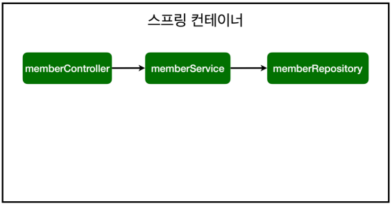

##  스프링 빈과 의존관계

>- 컴포넌트 스캔과 자동 의존관계 설정
>- 자바 코드로 직접 스프링 빈 등록하기

### 컴포넌트 스캔과 자동 의존관계 설정

회원 컨트롤러가 회원서비스와 회원 리포지토리를 사용할 수 있게 의존관계를 준비하자.


**회원 컨트롤러에 의존관계 추가**

```java
package hello.hellospring2.controller;

import org.springframework.beans.factory.annotation.Autowired;
import org.springframework.stereotype.Controller;

import hello.hellospring2.service.MemberService;

@Controller
public class MemberController {
	private final MemberService memberService;

	@Autowired  // <=================
	public MemberController(MemberService memberService) {
		this.memberService = memberService;
	}
}
```

- 생성자에 `@Autowired` 가 있으면 스프링이 연관된 객체를 스프링 컨테이너에서 찾아서 넣어준다. 이렇게 객체 의존관계를 외부에서 넣어주는 것을 **DI (Dependency Injection),** **의존성 주입**이라 한다.
- 이전 테스트에서는 개발자가 직접 주입했고, 여기서는 `@Autowired`에 의해 스프링이 주입해준다.


**오류 발생**

```java
Consider defining a bean of type 'hello.hellospring.service.MemberService' in your configuration.
```


> 참고: helloController는 스프링이 제공하는 컨트롤러여서 스프링 빈으로 자동 등록된다. 
>
> `@Controller` 가 있으면 자동 등록됨


**스프링 빈을 등록하는 2가지 방법**

- 컴포넌트 스캔과 자동 의존관계 설정

  > - `@Contorller` , `@Service` , `@Repository`의 어노테이션을 열어보면 `@Component`  어노테이션이 등록되어있다.
  > - `@Component`어노테이션을 스캔하여 다 객체를 생성하여 스프링 컨테이너에 올린(등록한)다.
  > - `@Autowired`는 Component간의 연관관계를 의미한다. (아래 13_2의 이미지와 같음)
  > - 아래 상세 정리

- 자바 코드로 직접 스프링 빈 등록하기


**컴포넌트 스캔 원리**

- `@Component` 애노테이션이 있으면 스프링 빈으로 자동 등록된다.

- `@Controller` 컨트롤러가 스프링 빈으로 자동 등록된 이유도 컴포넌트 스캔 때문이다.

  

- `@Component` 를 포함하는 다음 애노테이션도 스프링 빈으로 자동 등록된다.

  - `@Controller`
  - `@Service`
  - `@Repository`


**회원 서비스 스프링 빈 등록**

```java
@Service   // <=================
public class MemberService {
	private final MemberRepository memberRepository;

	@Autowired   // <=================
	public MemberService(MemberRepository memberRepository) {
		this.memberRepository = memberRepository;
 	}
}
```

> 참고: 생성자에 `@Autowired` 를 사용하면 객체 생성 시점에 스프링 컨테이너에서 해당 스프링 빈을 찾아서 주입한다. 생성자가 1개만 있으면 `@Autowired` 는 생략할 수 있다.

**회원 리포지토리 스프링 빈 등록**

```java
@Repository  // <=================
public class MemoryMemberRepository implements MemberRepository {}
```


**스프링 빈 등록 이미지**



- `memberService` 와 `memberRepository` 가 스프링 컨테이너에 스프링 빈으로 등록되었다.

> 참고: 스프링은 스프링 컨테이너에 스프링 빈을 등록할 때, 기본으로 싱글톤으로 등록한다(유일하게 하나만 등록해서 공유한다) 따라서 같은 스프링 빈이면 모두 같은 인스턴스다. 설정으로 싱글톤이 아니게 설정할 수 있지만, 특별한 경우를 제외하면 대부분 싱글톤을 사용한다.


> ex)  아무 폴더에 `@Component`를 써주면 빈에 올라갈까?
>
> HelloSpringApplicaiotn.java 파일이 포함되어있는 package의 하위를 뒤져서 스프링 빈으로 등록한다.
>
> - 패키지가 동일하거나 하위패키지가 아니면 컴포넌트 스캔하지 않는다.
> - 물론 설정을 해주면된다. 기본적으로 안된다.
> - `@SpringBootApplication`를 열어보면 `@ComponentScan`이란 어노테이션이 있음


> 스프링 컨테이너에서 스프링 빈이 관리된다.
>
> > 1. `스프링`이 처음에 뜰 때,  `스프링 컨테이너`라는 통이 생성됨 
> > 2. `@Component` 어노테이션의 객체를 생성하여 통이 넣어둔다.
> > 3. 스프링이 생성된 객체를 관리한다.  (스프링 컨테이너에서 스프링 빈이 관리된다.)