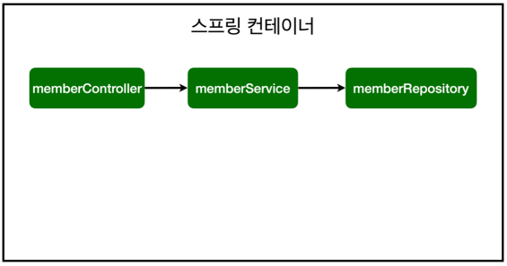

##  스프링 빈과 의존관계

>- 컴포넌트 스캔과 자동 의존관계 설정
>- 자바 코드로 직접 스프링 빈 등록하기

### 자바  코드로 직접 스프링 빈 등록하기

회원 서비스와 회원 리포지토리의 `@Service`, `@Repository`, `@Autowired` 애노테이션을 제거하고 진행한다




`@Configuration`으로 바꾸어  `@Bean` 넣어주어도 위와 같다.

```java
package hello.hellospring2;

import org.springframework.context.annotation.Bean;
import org.springframework.context.annotation.Configuration;

import hello.hellospring2.repository.MemberRepository;
import hello.hellospring2.repository.MemoryMemberRepository;
import hello.hellospring2.service.MemberService;

@Configuration // <===========
public class SpringConfig {
	@Bean // <===========
	public MemberService memberService() {
		return new MemberService(memberRepository());
	}

	@Bean // <===========
	public MemberRepository memberRepository() {
		return new MemoryMemberRepository();
	}

}
```

**여기서는 향후 메모리 리포지토리를 다른 리포지토리로 변경할 예정이므로, 컴포넌트 스캔 방식 대신에 자바 코드로 스프링 빈을 설정하겠다.**


> 참고: 
>
> XML로 설정하는 방식도 있지만 최근에는 잘 사용하지 않으므로 생략한다.


> 참고:   **생성자 주입**을 권장한다.
>
> - DI에는 필드 주입, setter 주입, 생성자 주입 이렇게 3가지 방법이 있다. 의존관계가 실행중에
>   동적으로 변하는 경우는 거의 없으므로 **생성자 주입**을 권장한다.
>
> > **생성자주입** : 우리가 지금 실습한 코드 
> >
> > ```java
> > @Controller
> > public class MemberController{
> >    	private final MemberService memberService;
> >     
> > 	@Autowired
> > 	public MemberController(MemberService memberService) {
> > 		this.memberService = memberService;
> > 	}
> > }
> > ```
> >
> > - **요즘에 권장하는 스타일!!**
> >   - 처음에 어플리케이션이 조립(스프링 컨테이너 올라가고, 세팅이 되는 시점)될 때, 생성자로 한번만 조립해버리고 끝내버릴 수 있음.
>
> > **필드주입** : 필드에 `@Autowired`로 입력
> >
> > ```java
> > @Controller
> > public class MemberController{
> > 
> >     @Autowired
> >     private MemberService memberService;
> > }
> > ```
> >
> > * 안좋음!!
> >
> >   * IntelliJ에서는 'Create constructor' 이라고 warring함
> >
> >   * 이유는?
> >
> >     바꿀 수 있는 방법이 없음. 즉, 스프링 뜰때만 넣어주고 중간에 바꿀 수 있는 방법이 아예 없음
>
> > **setter주입** : 생성은 생성대로 되고, setter은 나중에 호출되서 들어감
> >
> > ```java
> > @Controller
> > public class MemberController{
> > 
> >     private MemberService memberService;
> >     
> >     @Autowired
> >     public void setMemberService(MemberService memberService){
> >         this.memberService = memberService;
> >     }
> > }
> > ```
> >
> > - 안좋음!!
> >
> >   - 이유는?
> >
> >     - 누군가가 MemberController를 호출할 때, public으로 열려있어야 한다.
> >
> >     - 즉) 한번 세팅이되면 바꿀 일이 없는 데, public하게 노출이 되어버리는 거임.
> >
> >       ```java
> >       /* service */
> >       public class MemberService {
> >       	private MemberRepository memberRepository;
> >       
> >           @Autowired
> >       	public void setMemberRepository (MemberRepository memberRepository) {
> >       		this.memberRepository = memberRepository;                
> >        	} // <=======
> >       }
> >       
> >       /* controller */
> >       @Controller
> >       public class MemberController{
> >       
> >           private MemberService memberService;
> >           
> >           @Autowired
> >           public void setMemberService(MemberService memberService){
> >               this.memberService = memberService;
> >               memberService.setMemberRepository(); // <=======
> >           }
> >       }
> >       ```
> >
> >       - `memberService.setMemberRepository();` 아무 개발자나 호출할 수 있게 열려있게 되어버리는 거임.....
> >
> >     - 중간에 잘못 바꾸면 문제가 생겨버림.


> 참고: 
>
> 실무에서는 주로 정형화된 컨트롤러, 서비스, 리포지토리 같은 코드는 컴포넌트 스캔을 사용한다. 
>
> > 정형화된 코드 : 일반적으로 작성하는 컨트롤러, 서비스, 레포지토리를 의미.
>
> 그리고 정형화 되지 않거나, 상황에 따라 구현 클래스를 변경해야 하면 설정을 통해 스프링 빈으로
> 등록한다.
>
> > - *가상 시나리오에서 아직 DB선택되지 않았음. 이란 조건일때 를 의미함.*
> >
> > -  정형화 되지 않거나, 상황에 따라 구현 클래스를 변경해야 하면 설정 
> >
> >   ```java
> >   @Bean 
> >   public MemberRepository memberRepository() {
> >   	//return new MemoryMemberRepository();
> >   	return new DbMemberRepository(); 
> >   }
> >   ```
> >
> >   1. **다른 코드 전혀 변경할 필요없이 위와 같이 변경만 해주면된다.** (직접 설정 파일을 운영할 때의 장점!)
> >   2. 컴포넌트 스캔을 사용하면 여러 파일을 수정해야함... (간단하게 빈 설정파일만 수정해주면 된다.)
> >
> >   


> 주의:
>
> ` @Autowired` 를 통한 DI는 `helloController` , `memberService` 등과 같이 스프링이 관리하는
> 객체에서만 동작한다. 스프링 빈으로 등록하지 않고 내가 직접 생성한 객체에서는 동작하지 않는다.


> 스프링 컨테이너, DI 관련된 자세한 내용은 스프링 핵심 원리 강의에서 설명한다