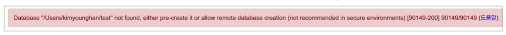

##  스프링 DB 접근 기술

>- H2 데이터베이스 설치
>- 순수 JDBC
>- 스프링 통합테스트
>- 스프링 JdbcTemplate
>- JPA
>- 스프링 데이터 JPA

### H2 데이터베이스 설치

개발이나 테스트 용도로 가볍고 편리한 DB, 웹 화면 제공

> 주의!
> h2 데이터베이스는 꼭 다음 링크에 들어가서 1.4.200 버전을 설치해주세요.
> 최근에 나온 2.0.206 버전을 설치하면 일부 기능이 정상 동작하지 않습니다.
> https://www.h2database.com/html/download-archive.html
>
> 만약 이미 설치하고 실행까지 했다면 다시 설치한 이후에 ~/test.mv.db 파일을 꼭 삭제해주세요.
> 그렇지 않으면 다음 오류가 발생하면서 접속되지 않습니다.
> General error: "The write format 1 is smaller than the supported format 2 
> [2.0.206/5]" [50000-202] HY000/50000


- https://www.h2database.com
- 다운로드 및 설치
- h2 데이터베이스 버전은 스프링 부트 버전에 맞춘다.
- 권한 주기: chmod 755 h2.sh (윈도우 사용자는 x)
- 실행: ./h2.sh (윈도우 사용자는 ``./h2.bat``) 
  - 나의 경로 : ``C:\Program Files (x86)\H2\bin``
  - 데이터베이스 파일 생성 방법
  - ``jdbc:h2:~/test`` (최초 한번 = 초기 설치 후, 접속할때)
  - ``~/test.mv.db`` 파일 생성 확인
    - 나의 경로 : ``C:\Users\82103``
    - 문제 있을 시, ``test.mv.db``파일 지우고 다시 시작
  - 이후부터는 ``jdbc:h2:tcp://localhost/~/test`` 이렇게 접속


### 테이블 생성하기

**테이블 관리를 위해 프로젝트 루트에 ``sql/ddl.sql`` 파일을 생성**

```sql
drop table if exists member CASCADE;
create table member
(
 id bigint generated by default as identity,
 name varchar(255),
 primary key (id)
);
```

> - java long => bigint
> - generated by default as identity 자동으로 id값 생성

H2 데이터베이스에 접근해서 ``member`` 테이블 생성


### H2 데이터베이스가 정상 생성되지 않을 때
다음과 같은 오류 메시지가 나오며 H2 데이터베이스가 정상 생성되지 않는 경우가 있다.



해결방안은 다음과 같다.

1. H2 데이터베이스를 종료하고, 다시 시작한다.
2. 웹 브라우저가 자동 실행되면 주소창에 다음과 같이 되어있다.(100.1.2.3이 아니라 임의의 숫자가 나온다.)


3. 다음과 같이 앞 부분만 ``100.1.2.3`` =>  ``localhost`` 로 변경하고 Enter를 입력한다. 나머지 부분은 절대
   변경하면 안된다. (특히 뒤에 세션 부분이 변경되면 안된다.)


4. 데이터베이스 파일을 생성하면( ``jdbc:h2:~/test``), 데이터베이스가 정상 생성된다.


> ddl 관리 팁!
>
> > spring프로젝트의 루트에 sql 폴더 생성하여 ddl.sql 파일만들어서 ddl 관리 가능
> >
> > - git을 통해 소스관리가 가능

