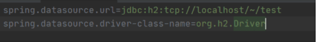

##  스프링 DB 접근 기술

>- H2 데이터베이스 설치
>- 순수 JDBC
>- 스프링 통합테스트
>- 스프링 JdbcTemplate
>- JPA
>- 스프링 데이터 JPA

### 순수 JDBC

환경설정

1. **build.gradle 파일에 jdbc, h2 데이터베이스 관련 라이브러리 추가**

```java
implementation 'org.springframework.boot:spring-boot-starter-jdbc'
runtimeOnly 'com.h2database:h2'
```

2. **스프링 부트 데이터베이스 연결 설정 추가**

`resources/application.properties`

```java
spring.datasource.url=jdbc:h2:tcp://localhost/~/test
spring.datasource.driver-class-name=org.h2.Driver
spring.datasource.username=sa
```

> 주의!: 스프링부트 2.4부터는 spring.datasource.username=sa 를 꼭 추가해주어야 한다. 그렇지
> 않으면 Wrong user name or password 오류가 발생한다. 참고로 다음과 같이 마지막에 공백이
> 들어가면 같은 오류가 발생한다. spring.datasource.username=sa 공백 주의, 공백은 모두
> 제거해야 한다

> 참고: 인텔리J 커뮤니티(무료) 버전의 경우 application.properties 파일의 왼쪽이 다음 그림고 같이
> 회색으로 나온다. 엔터프라이즈(유료) 버전에서 제공하는 스프링의 소스 코드를 연결해주는 편의 기능이
> 빠진 것인데, 실제 동작하는데는 아무런 문제가 없다



> 데이터베이스에 접근하기 위한 준비는 끝!
>
> - gradle에 implementation 추가하고 반영이 안되면, gradle파일 [ 우클릭 > Gradle > Refresh Gradle Project]를해준다. 


#### Jdbc 리포지토리 구현

주의! 이렇게 JDBC API로 직접 코딩하는 것은 20년 전 이야기이다. 따라서 고대 개발자들이 이렇게 고생하고 살았구나 생각하고, 정신건강을 위해 참고만 하고 넘어가자

1. **Jdbc 회원 리포지토리 생성** 

```java
package hello.hellospring2.repository;

import java.sql.Connection;
import java.sql.PreparedStatement;
import java.sql.ResultSet;
import java.sql.SQLException;
import java.sql.Statement;
import java.util.ArrayList;
import java.util.List;
import java.util.Optional;

import javax.sql.DataSource;

import org.springframework.jdbc.datasource.DataSourceUtils;

import hello.hellospring2.domain.Member;

public class JdbcMemberRepository implements MemberRepository {
	private final DataSource dataSource;

	public JdbcMemberRepository(DataSource dataSource) {
		this.dataSource = dataSource;
	}

	@Override
	public Member save(Member member) {
		String sql = "insert into member(name) values(?)";

		Connection conn = null;
		PreparedStatement pstmt = null;
		ResultSet rs = null;

		try {
			conn = getConnection();
			pstmt = conn.prepareStatement(sql, Statement.RETURN_GENERATED_KEYS);

			pstmt.setString(1, member.getName());

			pstmt.executeUpdate();
			rs = pstmt.getGeneratedKeys();

			if (rs.next()) {
				member.setId(rs.getLong(1));
			} else {
				throw new SQLException("id 조회 실패");
			}

			return member;
		} catch (Exception e) {
			throw new IllegalStateException(e);
		} finally {
			close(conn, pstmt, rs);
		}
	}

	@Override
	public Optional<Member> findById(Long id) {
		String sql = "select * from member where id = ?";

		Connection conn = null;
		PreparedStatement pstmt = null;
		ResultSet rs = null;

		try {
			conn = getConnection();
			pstmt = conn.prepareStatement(sql);

			pstmt.setLong(1, id);

			rs = pstmt.executeQuery();

			if (rs.next()) {
				Member member = new Member();
				member.setId(rs.getLong("id"));
				member.setName(rs.getString("name"));
				return Optional.of(member);
			} else {
				return Optional.empty();
			}
		} catch (Exception e) {
			throw new IllegalStateException(e);
		} finally {
			close(conn, pstmt, rs);
		}
	}

	@Override
	public List<Member> findAll() {
		String sql = "select * from member";

		Connection conn = null;
		PreparedStatement pstmt = null;
		ResultSet rs = null;

		try {
			conn = getConnection();
			pstmt = conn.prepareStatement(sql);

			rs = pstmt.executeQuery();

			List<Member> members = new ArrayList<>();
			while (rs.next()) {
				Member member = new Member();
				member.setId(rs.getLong("id"));
				member.setName(rs.getString("name"));
				members.add(member);
			}
			return members;
		} catch (Exception e) {
			throw new IllegalStateException(e);
		} finally {
			close(conn, pstmt, rs);
		}
	}

	@Override
	public Optional<Member> findByName(String name) {
		String sql = "select * from member where name = ?";

		Connection conn = null;
		PreparedStatement pstmt = null;
		ResultSet rs = null;

		try {
			conn = getConnection();
			pstmt = conn.prepareStatement(sql);

			pstmt.setString(1, name);

			rs = pstmt.executeQuery();

			if (rs.next()) {
				Member member = new Member();
				member.setId(rs.getLong("id"));
				member.setName(rs.getString("name"));
				return Optional.of(member);
			}
			return Optional.empty();
		} catch (Exception e) {
			throw new IllegalStateException(e);
		} finally {
			close(conn, pstmt, rs);
		}
	}

	private Connection getConnection() {
		return DataSourceUtils.getConnection(dataSource);
	}

	private void close(Connection conn, PreparedStatement pstmt, ResultSet rs) {
		try {
			if (rs != null) {
				rs.close();
			}
		} catch (SQLException e) {
			e.printStackTrace();
		}
		try {
			if (pstmt != null) {
				pstmt.close();
			}
		} catch (SQLException e) {
			e.printStackTrace();
		}
		try {
			if (conn != null) {
				close(conn);
			}
		} catch (SQLException e) {
			e.printStackTrace();
		}
	}

	private void close(Connection conn) throws SQLException {
		DataSourceUtils.releaseConnection(conn, dataSource);
	}
}
```


2. **스프링 설정 변경**

```java
package hello.hellospring2;

import javax.sql.DataSource;

import org.springframework.context.annotation.Bean;
import org.springframework.context.annotation.Configuration;

import hello.hellospring2.repository.JdbcMemberRepository;
import hello.hellospring2.repository.MemberRepository;
import hello.hellospring2.service.MemberService;

@Configuration
public class SpringConfig {
	private final DataSource dataSource;

	public SpringConfig(DataSource dataSource) {
		this.dataSource = dataSource;
	}

	@Bean
	public MemberService memberService() {
		return new MemberService(memberRepository());
	}

	@Bean
	public MemberRepository memberRepository() {
// return new MemoryMemberRepository();
		return new JdbcMemberRepository(dataSource);
	}
}

```

> 어떤 코드도 손대지 않았어. SpringConfig.java(조립코드 (어셈블 코드)) 파일만 손됬어!
>
> JdbcMemberRepository만 생성하고.
>
> > 이런게 객체지향적인거고 스프링의 장점이야. (interface로 다형성을 주잖아)


- DataSource는 데이터베이스 커넥션을 획득할 때 사용하는 객체다. 스프링 부트는 데이터베이스 커넥션 정보를 바탕으로 DataSource를 생성하고 스프링 빈으로 만들어둔다. 그래서 DI를 받을 수 있다


- **개방-폐쇄 원칙(OCP, Open-Closed Principle)**

  - 확장에는 열려있고, 수정, 변경에는 닫혀있다.

    - interface와 같이 객체지향의 다형성을 잘 이용한다면, 기능을 완전히 변경을 해도 애플리케이션 전체를 수정할 필요가 없다. 

      - 조립(어셈블)하는 코드는 수정을 해야돼 (위의 SpringConfig.java)
      - 하지만, 실제 애플리케이션이 동작하는 코드는 하나도 변경하지 않아도된다.

      

- **스프링의 DI (Dependencies Injection)을 사용하면 기존 코드를 전혀 손대지 않고, 설정만으로 구현 클래스를 변경할 수 있다.**

  

- 회원을 등록하고 DB에 결과가 잘 입력되는지 확인하자.
- 데이터를 DB에 저장하므로 스프링 서버를 다시 실행해도 데이터가 안전하게 저장된다


