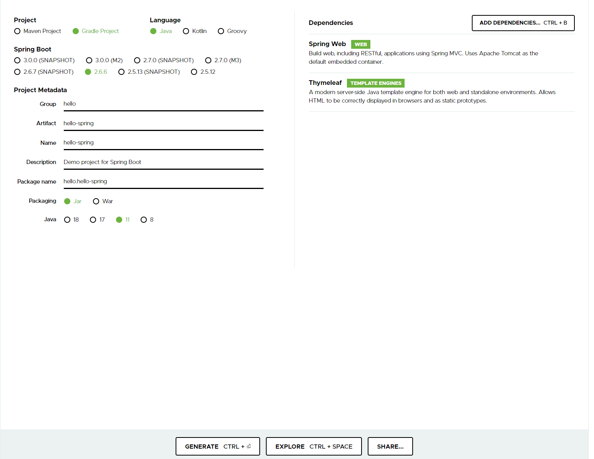
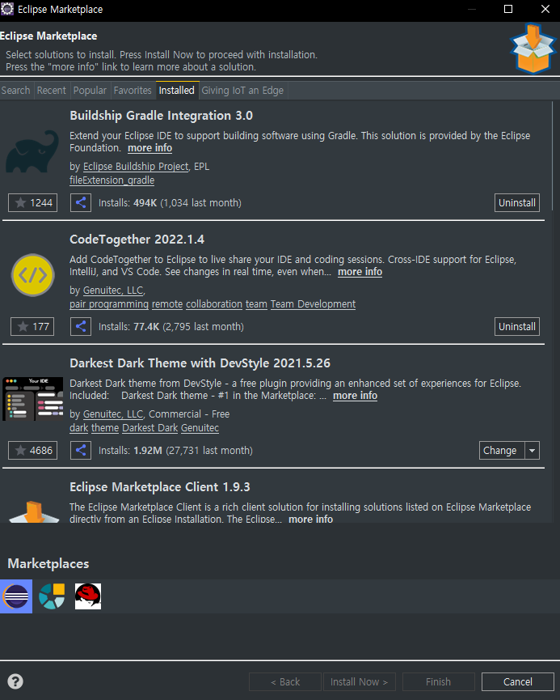
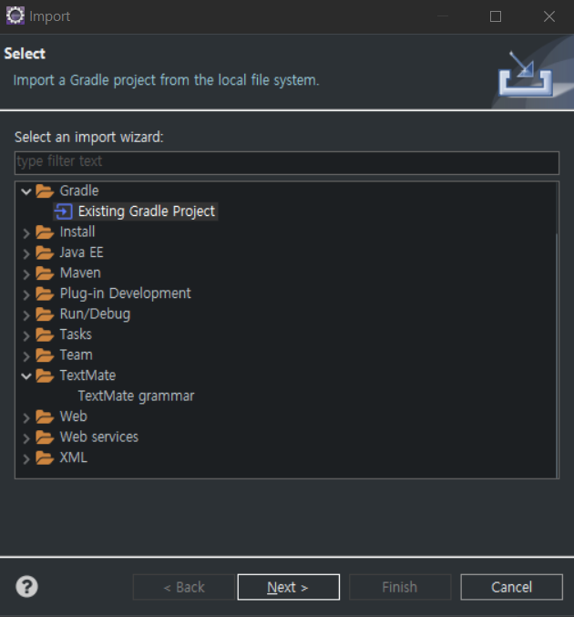
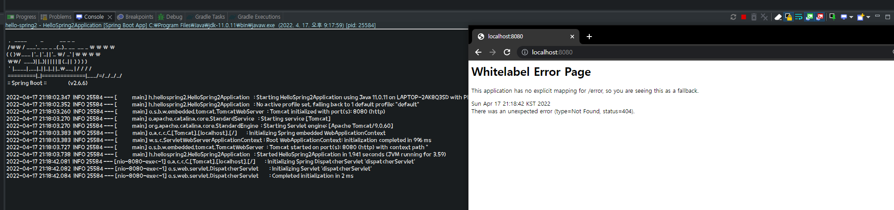

##  **프로젝트 생성하기** 

#### 사전 준비

- Java 11 설치
- IDE intelliJ (무료버전) 또는 Eclipse 


#### 스프링 부트로 프로젝트 생성하기



[스프링 부트 스타터 사이트](http://start.spring.io/)로 이동해서 원하는 설정으로 스프링 프로젝트를 생성할 수가 있다.

이 때, 프로젝트에서 사용할 라이브러리를 두 개 추가한다.

- spring web
- thymeleaf


### eclipse import 방식

1. 이클립스 Buildship Gradle Integeration 3.0 플로그인 설치 



2. 스프링부트 스타터 사이트에서 다운받은 프로젝트 import하기 (Existing Gradle Project)

   


#### 프로젝트 구조

이를 통해서 생성된 파일 밑 build.gradle을 intelliJ에서 open 해주면 IntelliJ IDE에서 사용할 수 있도록 프로젝트 파일이 임포트된다.

이 IDE에서 보여지는 해당 프로젝트의 구조는 다음과 같다.

- .gradle
- .idea : 인텔리제이가 사용하는 설정 파일
- gradle : gradle 관련 설정 파일이 들어가는 폴더
- src
  - main
    - java : 자바 파일들이 들어가는 폴더
    - resources: 자바 파일 이외의 모든 파일이 들어가는 폴더
      - static :정적 파일이 들어가는 폴더
      - templates : 템플릿 엔진이 사용할 파일이 들어가는 폴더
  - test : 테스트 코드와 관련된 파일들이 들어가는 폴더
    - java
- .gitignore : 깃허브에 올라가면 안되는 요소(ex - build된 결과물들)을 지정한 파일
- build.gradle : 버전 설정과 라이브러리를 다운받는데 사용되는 폴더
- gradlew
- gradlew.bat
- HELP.md
- settings.gradle


build.gradle에서는 다음과 같은 설정들이 존재한다.

- repositories - 라이브러리를 다운 받는 경로를 지정
- dependencies - 프로젝트에서 다운 받을 라이브러리들을 지정

```bash
plugins {
	id 'org.springframework.boot' version '2.4.1'
	id 'io.spring.dependency-management' version '1.0.10.RELEASE'
	id 'java'
}

group = 'com.heejin'
version = '0.0.1-SNAPSHOT'
sourceCompatibility = '11'

repositories {
	mavenCentral()
}

dependencies {
	implementation 'org.springframework.boot:spring-boot-starter-thymeleaf'
	implementation 'org.springframework.boot:spring-boot-starter-web'
	testImplementation 'org.springframework.boot:spring-boot-starter-test'
}

test {
	useJUnitPlatform()
}
```


### HelloSpringApplication.java 실행

```java
package hello.hellospring2;

import org.springframework.boot.SpringApplication;
import org.springframework.boot.autoconfigure.SpringBootApplication;

@SpringBootApplication
public class HelloSpring2Application {

	public static void main(String[] args) {
		SpringApplication.run(HelloSpring2Application.class, args);
	}

}
```

스프링 부트는 톰캣 내장 서버를 포함하고 있어 SpringApplication.run(App.class,args); 명령어로 서버를 시작할 수 있다.

- 이클립스 실행 버튼 클릭

