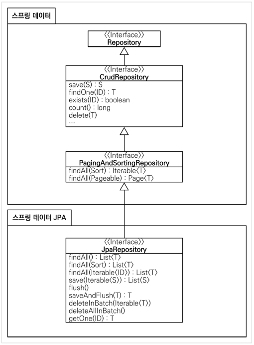

##  스프링 DB 접근 기술

>- H2 데이터베이스 설치
>- 순수 JDBC
>- 스프링 통합테스트
>- 스프링 JdbcTemplate
>- JPA
>- 스프링 데이터 JPA

### 스프링 데이터 JPA

> - 스프링 부트와 JPA만 사용해도 개발 생산성이 정말 많이 증가하고, 개발해야할 코드도 확연히 줄어듭니다. 
> - 여기에 스프링 데이터 JPA를 사용하면, 기존의 한계를 넘어 마치 마법처럼, 리포지토리에 구현 클래스 없이 **인터페이스** 만으로 개발을 완료할 수 있습니다. 그리고 반복 개발해온 기본 CRUD 기능도 스프링 데이터 JPA가 모두 제공합니다. 
> - 스프링 부트와 JPA라는 기반 위에, **스프링 데이터 JPA라는 환상적인 프레임워크**를 더하면 개발이 정말 즐거워집니다. 지금까지 조금이라도 단순하고 반복이라 생각했던 개발 코드들이 확연하게 줄어듭니다.  
> - 따라서 개발자는 핵심 비즈니스 로직을 개발하는데, 집중할 수 있습니다. 
>
> 실무에서 관계형 데이터베이스를 사용한다면 스프링 데이터 JPA는 이제 선택이 아니라 **필수** 입니다.


> **주의**: 스프링 데이터 JPA는 JPA를 편리하게 사용하도록 도와주는 기술입니다. 따라서 JPA를 먼저 학습한 후에 스프링 데이터 JPA를 학습해야 합니다.

1. **스프링 데이터 JPA 회원 리포지토리**

```java
package hello.hellospring2.repository;

import java.util.Optional;

import org.springframework.data.jpa.repository.JpaRepository;

import hello.hellospring2.domain.Member;

//JpaRepository를 상속받으면 스프링데이터JPA가 인터페이스에 대한 구현체를 만들어낸다.
//만들어낸 후, 스프링 빈에 등록해둔다. 
public interface SpringDataJpaMemberRepository extends JpaRepository<Member, Long>, MemberRepository {
	
	// 네이밍 규칙에 따라 쿼리를 짜준다.
	// JPQL : select m from Member m where m.name = ?
	Optional<Member> findByName(String name);
	
}
```


2. **스프링 데이터 JPA 회원 리포지토리를 사용하도록 스프링 설정 변경**

```java
package hello.hellospring2;

import javax.persistence.EntityManager;
import javax.sql.DataSource;

import org.springframework.context.annotation.Bean;
import org.springframework.context.annotation.Configuration;

import hello.hellospring2.repository.JpaMemberRepository;
import hello.hellospring2.repository.MemberRepository;
import hello.hellospring2.service.MemberService;

@Configuration
public class SpringConfig {
	private final MemberRepository memberRepository;

	public SpringConfig(MemberRepository memberRepository) {
		this.memberRepository = memberRepository;
	}

	@Bean
	public MemberService memberService() {
		return new MemberService(memberRepository);
	}

	/* JPA
	private final DataSource dataSource;
	private final EntityManager em;

	public SpringConfig(DataSource dataSource, EntityManager em) {
		this.dataSource = dataSource;
		this.em = em;
	}

	@Bean
	public MemberService memberService() {
		return new MemberService(memberRepository());
	}

	@Bean
	public MemberRepository memberRepository() {
// return new MemoryMemberRepository();
// return new JdbcMemberRepository(dataSource);
// return new JdbcTemplateMemberRepository(dataSource);
		return new JpaMemberRepository(em);
	}
	*/
}
```

- 스프링 데이터 JPA가 `SpringDataJpaMemberRepository` 를 스프링 빈으로 자동 등록해준다


**스프링 데이터 JPA 제공 클래스**



**스프링 데이터 JPA 제공 기능**

- 인터페이스를 통한 기본적인 CRUD
- `findByName()` , `findByEmail()` 처럼 메서드 이름 만으로 조회 기능 제공
  - 네이밍 규칙에 따라 쿼리를 짜준다. (인터페이스 이름만으로)
  - 마법이네... 리플렉션에서 처리
  - EX)
    - `findByName()` JPQL : select m from Member m where m.name = ?
- 페이징 기능 자동 제공


> 참고: 실무에서는 JPA와 스프링 데이터 JPA를 기본으로 사용하고, 복잡한 동적 쿼리는 **Querydsl이라는 라이브러리를 사용**하면 된다. Querydsl을 사용하면 쿼리도 자바 코드로 안전하게 작성할 수 있고, 동적 쿼리도 편리하게 작성할 수 있다. 이 조합으로 해결하기 어려운 쿼리는 JPA가 제공하는 네이티브 쿼리를 사용하거나, 앞서 학습한 스프링 JdbcTemplate를 사용하면 된다. 

- 자세한 내용은 다음 강의를 참고하자: 인프런 - 실전! 스프링 데이터 JPA