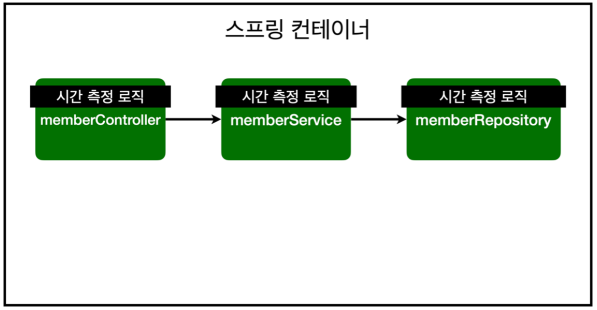

##  AOP

**AOP가 필요한 상황**

- 모든 메소드의 호출 시간을 측정하고 싶다면?
- **공통 관심 사항(cross-cutting concern)** vs **핵심 관심 사항(core concern)**
- 회원 가입 시간, 회원 조회 시간을 측정하고 싶다면?




**MemberService 회원 조회 시간 측정 추가**

```java
package hello.hellospring.service;
@Transactional
public class MemberService {

	/**
	 * 회원가입
	 */
	public Long join(Member member) {
		 long start = System.currentTimeMillis();
		 
		try{
			validateDuplicateMember(member); // 중복 회원 검증
			memberRepository.save(member);
			return member.getId();
		}finally {
			 long finish = System.currentTimeMillis();
			 long timeMs = finish - start;
			 System.out.println("join " + timeMs + "ms");
		}
	}
    
	/**
	 * 전체 회원 조회
	 */
	public List<Member> findMembers() {
		 long start = System.currentTimeMillis();
		 
		 try {
			 return memberRepository.findAll();
		 }finally {
			 long finish = System.currentTimeMillis();
			 long timeMs = finish - start;
			 System.out.println("findMembers " + timeMs + "ms");
		 }
	}
    
}
```

> 일일히 모든 메소드에다가 `System.currentTimeMillis();`를 해서 찍고 있어...
>
> > 아래와 같은 문제들이 있어.


**문제**

- 회원가입, 회원 조회에 시간을 측정하는 기능은 **핵심 관심 사항이 아니다.**
- 시간을 측정하는 로직은 **공통 관심 사항**이다.
- 시간을 측정하는 로직과 핵심 비즈니스의 로직이 섞여서 유지보수가 어렵다.
- 시간을 측정하는 로직을 별도의 **공통 로직**으로 만들기 매우 어렵다.
- 시간을 측정하는 로직을 변경할 때 **모든 로직을 찾아가면서 변경**해야 한다.