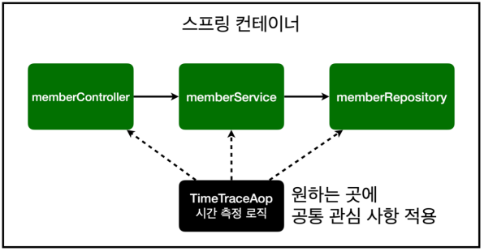
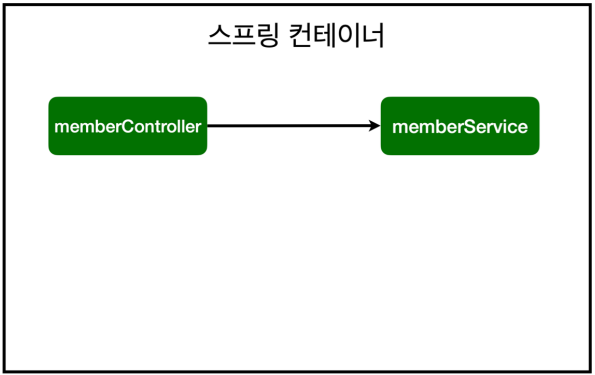
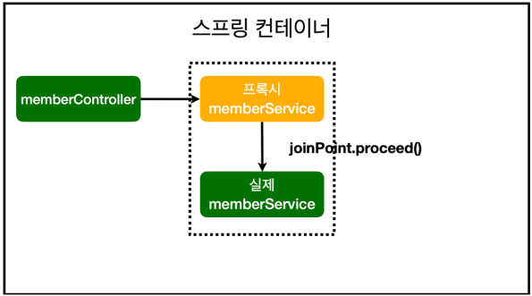
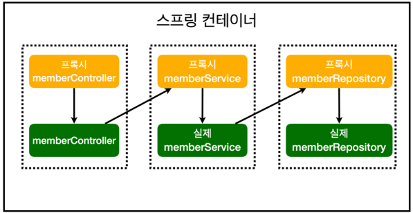

##  AOP 적용

- AOP: Aspect Oriented Programming (관점 지향 프로그래밍)
- 공통 관심 사항(cross-cutting concern) vs 핵심 관심 사항(core concern) 분리




**시간 측정 AOP 등록**

```java
package hello.hellospring2.aop;

import org.aspectj.lang.ProceedingJoinPoint;
import org.aspectj.lang.annotation.Around;
import org.aspectj.lang.annotation.Aspect;
import org.springframework.stereotype.Component;

//@Component
// Component스캔으로 하는 것보다 AOP를 사용한다고 SpringConfig 파일에 Bean으로 명시해주는게 좋다.
@Aspect
public class TimeTraceAop {
	
	@Around("execution(* hello.hellospring2..*(..))")
	public Object execute(ProceedingJoinPoint joinPoint) throws Throwable {
		long start = System.currentTimeMillis();
		System.out.println("START: " + joinPoint.toString());
	
		try {
			return joinPoint.proceed();
		} finally {
			long finish = System.currentTimeMillis();
			long timeMs = finish - start;
			
			System.out.println("END: " + joinPoint.toString() + " " + timeMs + "ms");
		}
	}
	
}
```


**해결**

- 회원가입, 회원 조회등 핵심 관심사항과 시간을 측정하는 공통 관심 사항을 분리한다.
- 시간을 측정하는 로직을 별도의 공통 로직으로 만들었다.
- 핵심 관심 사항을 깔끔하게 유지할 수 있다.
- 변경이 필요하면 이 로직만 변경하면 된다.
- 원하는 적용 대상을 선택할 수 있다.
- **어디서 병목이 이루어나는 지 확인할 수 있따.**


### 스프링의 AOP 동작 방식 설명

1. **AOP 적용 전 의존관계**



2. **AOP 적용 후 의존관계**



> 가짜 MemberService를 만들어 (프록시)
>
> > 1. 스프링이 올라올 때(컨테이너에 스프링 빈을 등록할 때), 진짜 스프링 빈이 아닌 가짜 스프링 빈을 앞에 세워둔다.
> > 2. 가짜 스프링 빈이 `joinPoint.proceed()`를 내부적으로 수행 후, 진짜 스프링 빈을 호출한다.


1. **AOP 적용 전 전체 그림**


2. **AOP 적용 후 전체 그림**




- 실제 Proxy가 주입되는지 콘솔에 출력해서 확인하기

  ```java
  //실제로 inject하는 생성자부분에 다음과 코드를 입력하면 프록시 객체 여부를 확인할 수 있다.
  
  @Autowired
  public MemberController(MemberService memberServicd){
  	this.memberService = memberService;
      System.out.println("memberService = " + merberService.getClass());    
  }
  ```


> 이런게 DI의 장점입니다!