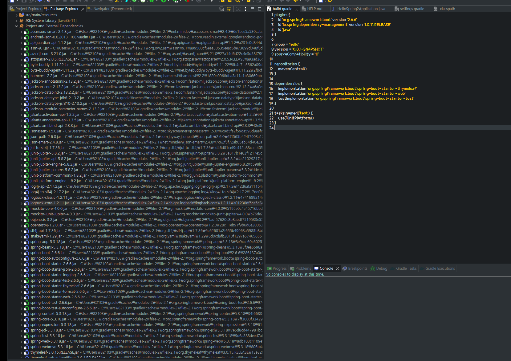

##  라이브러리 살펴보기

>  Gradle은 의존관계가 있는 라이브러리를 함께 다운로드 한다

#### 스프링 부트 라이브러리 

- spring-boot-starter-web 
  - spring-boot-starter-tomcat: 톰캣 (웹서버)
    - **과거**
      - 그전에  was를 서버에 설치하고 자바코드를 밀어넣는 식으로 계산
      - 웹서버랑 개발 라이브러리가 분리되어있었음
      - tomcat 서버 들어가서 설치함
    - **최근**
      - 소스 라이브러리에서 webserver를 들고있음 (embeded)  
    - spring-webmvc: 스프링 웹 MVC 
  - spring-boot-starter-thymeleaf: 타임리프 템플릿 엔진(View)
  -  **spring-boot-starter(공통): 스프링 부트 + 스프링 코어 + 로깅** 
    - spring-boot 
      - spring-core 
    - spring-boot-starter-logging 
      - logback, slf4j
        - 로그파일 관리가 된다. (ex. 중요한 로그같은거 모아서 정리가능)
        - 그래서 sysout을 안쓴다.
        - 최근 : logback 사용
          - log4j, 인터페이스
          - **logback, 로그를 어떤 구현체로 출력할까? 성능 빠르고 지원도 좋음**

#### 테스트 라이브러리 

- spring-boot-starter-test 
  - **junit: 테스트 라이브러리**(junit5)
  - mockito: 목키토 라이브러리 
  - assertj: 테스트 코드를 좀 더 편하게 작성하게 도와주는 라이브러리 
  - spring-test: 스프링 통합 테스트 지원

#### 참고

- [이클립스에서 Gradle을 사용하는 환경에서 라이브러리를 추가하거나 dependencies 를 다시 다운로드하고 싶거나 갱신하고 싶을 때](https://gocoder.tistory.com/2419)