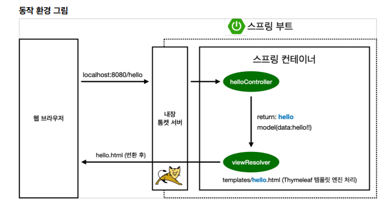

##  View 환경설정

>  Gradle은 의존관계가 있는 라이브러리를 함께 다운로드 한다

#### Welcome Page 만들기 

```html
<!DOCTYPE HTML>
<html>
<head>
     <title>Hello</title>
     <meta http-equiv="Content-Type" content="text/html; charset=UTF-8" />
</head>
<body>
    Hello
    <a href="/hello">hello</a>
</body>
</html>
```

- 스프링 부트가 제공하는 Welcome Page 기능 
  - static/index.html 을 올려두면 Welcome page 기능을 제공한다. 
  - [스프링 홈페이지](https://docs.spring.io/spring-boot/docs/2.3.1.RELEASE/reference/html/spring-boot-features.html#boot-features-spring-mvc-welcome-page)
    - projects > spring Boot > learn > version doc 클릭> spring boot feature > '원하는 내용 검색하여 찾기'
    - **스프링 홈페이지에서 원하는 기능 검색하여 찾을 수 있어야한다!**


#### thymeleaf 템플릿 엔진

- [thymeleaf 공식 사이트](https://www.thymeleaf.org/)
- [스프링 공식 튜토리얼](https://spring.io/guides/gs/serving-web-content/)
- [스프링부트 메뉴얼](https://docs.spring.io/spring-boot/docs/2.3.1.RELEASE/reference/html/spring-boot-features.html#boot-features-spring-mvc-template-engines)

- 템플릿 엔진 종류
  - FreeMarker
  - Groovy
  - Thymeleaf
  - Mustache


#### 동작 환경 그림



- **컨트롤러에서 리턴 값으로 문자를 반환하면 뷰 리졸버( `viewResolver` )가 화면을 찾아서 처리한다.**
  - 스프링 부트 템플릿엔진 기본 viewName 매핑
  - `resources:templates/` +{ViewName}+ `.html`

> 참고: `spring-boot-devtool`라이브러리를 추가하면, `html` 파일을 컴파일만 해주면 서버 재시작 없이
> View 파일 변경이 가능하다.
>
> - java파일은 수정 시, 서버를 껏다가 다시 켜야 반영된다.
>
> 인텔리J 컴파일 방법: 메뉴 build -> Recompile

