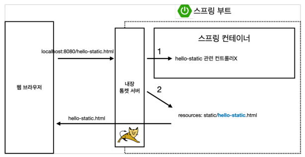

##  정적 콘텐츠

- 정적 컨텐츠 : html 등 파일을 그대로 브라우저로 전달
- MVC와 템플릿 엔진 : 서버에서 변형해서 내려주는 방식
- API : JSON 데이터 구조 포멧으로 전달하는 방식 (Front-End, 서버끼리 통신)


### 정적  컨텐츠

> 스프링 부트는 정적 컨텐츠를 기본적으로 제공

-  resources/static 폴더

```html
<!DOCTYPE HTML>
<html>
<head>
 <title>static content</title>
 <meta http-equiv="Content-Type" content="text/html; charset=UTF-8" />
</head>
<body>
정적 컨텐츠 입니다.
</body>
</html>
```

- 파일 생성 경로 : resources/static/hello-static.html

- 호출 URL : http://localhost:8080/hello-static.html

- 정적 컨텐츠 동작 이미지

  

