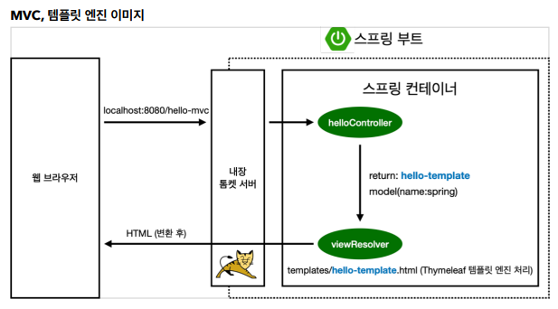

##  MVC와 템플릿 엔진

- 정적 컨텐츠 : html 등 파일을 그대로 브라우저로 전달
- MVC와 템플릿 엔진 : 서버에서 변형해서 내려주는 방식
- API : JSON 데이터 구조 포멧으로 전달하는 방식 (Front-End, 서버끼리 통신)


### MVC와  템플릿 엔진

> MVC : Model, View, Controller

- 과거 : 모델1 방식 (View[JSP]에 모든걸 다함) 
  - Bad Case) JSP 라인이 수천줄
- 최근 : 각자의 기능에 맞게 나누어서 개발진행


- **Controller**

```java
@Controller
public class HelloController {
     @GetMapping("hello-mvc")
     public String helloMvc(@RequestParam("name") String name, Model model) {
   	 	model.addAttribute("name", name);
     	return "hello-template";
     }
}
```

- View

```html
<html xmlns:th="http://www.thymeleaf.org">
<body>
<p th:text="'hello ' + ${name}">hello! empty</p>
</body>
```


- 호출 URL : http://localhost:8080/hello-mvc/name=spring

- MVC, 템플릿 엔진 동작 이미지

  


