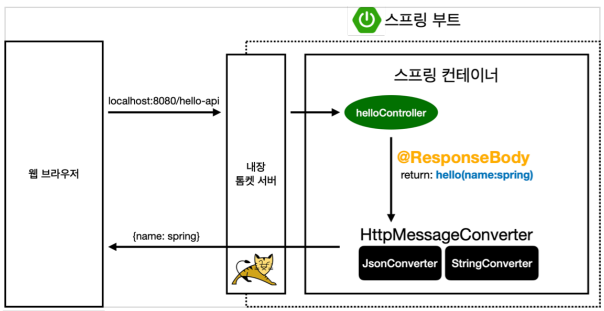

##  API

- @ResponseBody 문자 반환

  ```java
  @Controller
  public class HelloController {
       @GetMapping("hello-string")
       @ResponseBody
       public String helloString(@RequestParam("name") String name) {
       	return "hello " + name;
       }
  }
  ```

  - ```@ResponseBody``` 를 사용하면 ```viewResolver```를 사용하지 않음
  - 대신에 HTTP의 Body에 문자 내용을 직접 반환(HTML Body TAG를 말하는 것이 아님)

실행 Command)

- http://localhost:8080/hello-string?name=spring


```java
@Controller
public class HelloController {
     
    @GetMapping("hello-api")
    @ResponseBody
     public Hello helloApi(@RequestParam("name") String name) {
         Hello hello = new Hello();
         hello.setName(name);
         return hello;
     }
    
     static class Hello {
         private String name;
         
         public String getName() {
         	return name;
         }
         
         public void setName(String name) {
         	this.name = name;
         }
     }
}
```

- ```@ResponseBod```를 사용하고, 객체를 반환하면 객체가 JSON형태로 변환됨

실행 Command)

- http://localhost:8080/hello-string?name=spring


@ResponseBody 사용 원리 이미지

​	

- ```@ResponseBody``` 를 사용

  - HTTP의 BODY에 문자 내용을 직접 반환
  - ```viewResolver``` 대신에 ```HttpMessageConverter``` 가 동작
  - 기본 문자처리: ```StringHttpMessageConverter```
  - 기본 객체처리: ```MappingJackson2HttpMessageConverter``` (JSON변환한다.)
  - byte 처리 등등 기타 여러 HttpMessageConverter가 기본으로 등록되어 있음

  

> 참고: 클라이언트의 HTTP Accept 해더와 서버의 컨트롤러 반환 타입 정보 둘을 조합해서
> ```HttpMessageConverter```가  선택된다. 더 자세한 내용은 스프링 MVC 강의에서 설명하겠다 
>
> > 요즘엔 JSON만 쓴다. 정도로만 알자