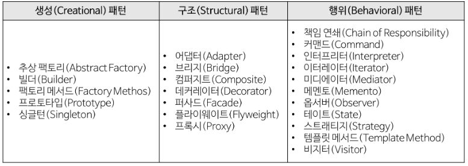

## 디자인 패턴이란 ?

----

> 디자인 패턴이란 프로그램을 설계할 때 발생하였던 문제점들을 객체 간의 상호 관계등을 이용하여 해결할 수 있도록 하나의 '규약' 형태로 만들어 놓은 것을 의미한다.

### GoF 디자인 패턴

- Gang of Fours 

- 23.가지 디자인 패턴을 **3가지 유형**으로 분류한다.

  

1. 생성(Creational) 패턴
   - 객체를 생성하는데 관련된 패턴들
   - 객체가 생성되는 과정의 유연성을 높이고 손쉬운 코드의 유지
2. 구조(Structural) 패턴
   - 프로그램 구조에 관련된 패턴들
   - 프로그램 내의 자료구조 또느 인터페이스 구조 등 프로그램의 구조를 설계하는 데 활용 가능한 패턴들
   - 클래스나 객체를 조합해 더 큰 구조를 만드는 패턴
3. 행위(Behavioral) 패턴
   - 반복적으로 사용되는 객체들의 상호작용을 패턴화한 것들
   - 결합도를 최소화하는 것에 중좀
   - 객체(클래스) 사이에 알고리즘이나 책임 분배에 관련 패턴