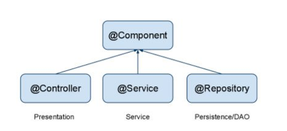
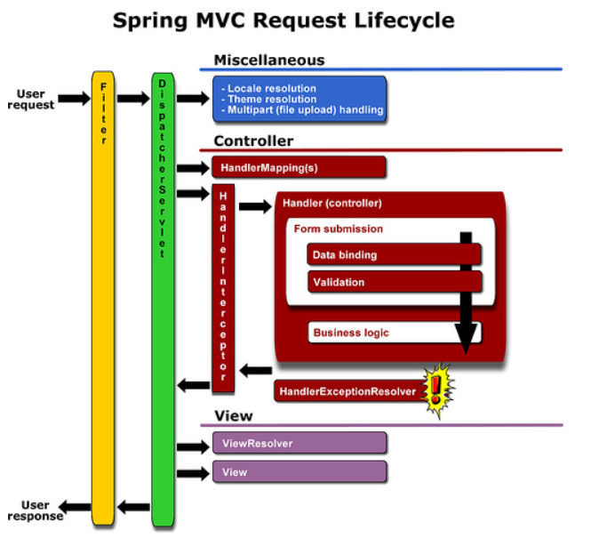
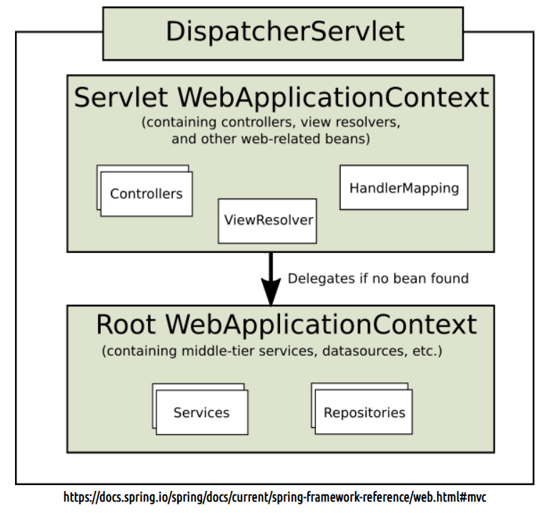

# 공부내용 정리

### context:component-scan

>  애노테이션의 관계



```java
<context:component-scan base-package="com.project.controller" />
```

- base-package에 component-scan을 할 패키지 경로를 명시해주면 해당 경로를 포함한 모든 하위 경로에 적용됨
- 애노테이션을 명시한 자바 파일들이 Bean으로 등록되어 사용가능해짐


### VO와 DTO의 차이

- DTO(Data Transfer Object)
  - 계층간 데이터 교환을 위한 객체(Java Beans)
  - DB에서 데이터를 얻어 Service나 Controller 보낼 때 사용됨
  - getter/setter 메서드만 가짐
- VO(Value Object)
  - DTO와 동일 개념이지만 read only 속성을 가짐
  - VO는 특정한 비즈니스 값을 담는 객체이고, DTO는 Layer간의 통신 용도로 오고가는 객체


### Spring MVC request Life Cycle

> Browser로 부터 request가 들어왔을 때 처리과정



* 순서

1. web.xml의 filter 통해서 넘어옴 
   - ex) filter에서 설정해준 utf-8설정을 통해 넘어와서 전부 utf-8로 바뀜
2. DispatcherServlet을 거침(=프론트 컨트롤러 역활을 함)
3. locale, thema, multipart(file upload) handling
   * multipartresolver
     * servlet-context.xml에서 setting
4. Controller
   * handlerIntecepter -> handle처리(=spring Intercepter, 우리가 말하는 처리를 말함)
     * 여기에 controller가 처리되기 전에 intercepter 설정해줌
     * 그림에서는 그렇게 보이지 않지만 controller 밖에서 감싸고있음 
     * aop는 controller 안에서 감싸고 있음
   * pre(Intercepter)
   * aop
     * before
     * after
   * post(Intercepter)
5. view
   * viewResolver


### AOP와 Intercepter 차이

* AOP
  * target : method, parameter
  * @Before
  * @After
  * After Returning
* Intercepter
  * target : request, response(controller)
  * preHandle()
  * postHandle()
  * afterCompletion


### root-context.xml, servlet-context.xml, web.xml



* root-context.xml 

  * controller 속에서 처리
  * 다른 웹 컴포넌트들과 공유하는 자원들을 선언하는 용도로 사용
  * view와 관련되지 않은 객체를 정의 (jsp와 관련 없는)
  * service, dao, repository등

* servlet-context.xml 

  * dispatcherservlet 속에서 처리
  *  DispatcherServlet의 request-processing에 관한 내용이 선언
  * 요청과 관련된 객체 정의(jsp와 관련 있는)
  * controller, annotation, viewResolve, Interceptor(로그인), MultipartResolve(파일업로드)

* web.xml

  * 설정을 위한 설정파일
  * 배포자 기술자 DD(Deployment Descriptor)
  * WAS(Web Application Server)가 최초 구동될 때(톰켓이 최초 구동될 때) web.xml을 읽고 그에 해당하는 설정을 구성한다.
  * 여러 xml파일을 인식하도록 각 파일을 가리켜준다.

  

  ** servlet-context는 root-context의 bean를 참조할 수 있지만 반대는 불가능


